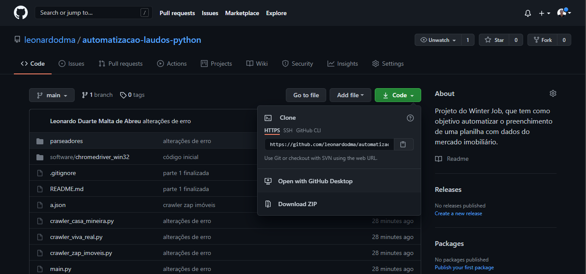
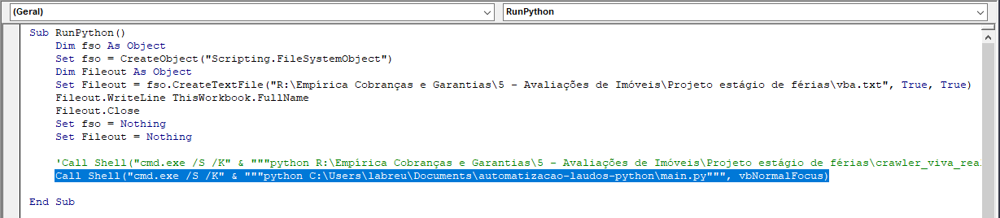

# Projeto Empírica Investimentos - Estágio de Férias

Projeto do Winter Job, que tem como objetivo automatizar o preenchimento de uma planilha com dados do mercado imobiliário.

## Tutorial de Instalação Python

No Windows, instalar o Python, no link (<https://www.python.org/downloads/windows/>). Na instalação, selecione a opção `add python to PATH` como na imagem abaixo, para que os códigos em python consigam ser executados por meio do prompt de comando.

Clique em `Install Now`. No computador da empresa, será necessário que a equipe de TI coloque as credenciais para prosseguir com a Instalação.

Para verificar e a instalação foi feita com sucesso, execute no terminal do windows `python --version`. Caso aparça a versão, como `Python 3.9.6`(depende da versão instalada), a instalação foi feita com sucesso e você já pode seguir para o próximo passo.

## Baixando os arquivos

No endereço (<https://github.com/leonardodma/automatizacao-laudos-python>), fazer o download dos arquivos python no botão `Download ZIP`. Extrair a pasta `automatizacao-laudos-python` na pasta Documentos do computador.

## Tutorial de instalação de pacotes

No terminal (prompt de comando) do Windows, executar:  

* `cd C:\Users\NOME_USUARIO\Documents\automatizacao-laudos-python`, substituindo 'NOME_USUARIO' pelo seu login da empírica (ex-labreu).

* `pip install -r requirements.txt`

Após isso, os pacotes já estarão instalados.

## Editando a Macro

Para pesquisar os imóveis, o botão `Procurar Dados` utiliza a macro `RunPython`. Nela, é especificado o caminho que encontra o arquivo Python `main.py` no seu computador. Edite a marcro, alterando novamente para o seu respectivo usuário da empírica.

## FIM :)

Após isso, seu computador já será capaz de realizar os laudos automaticamente.
